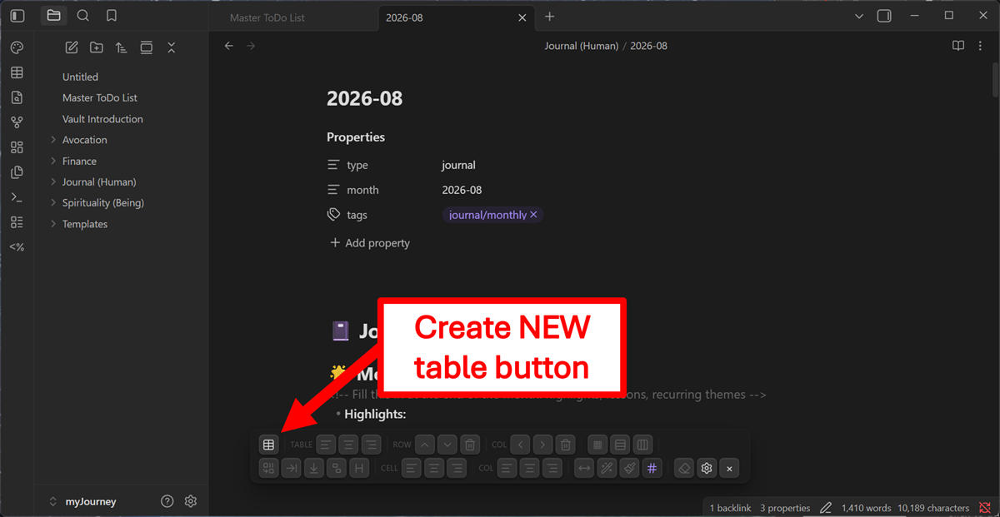
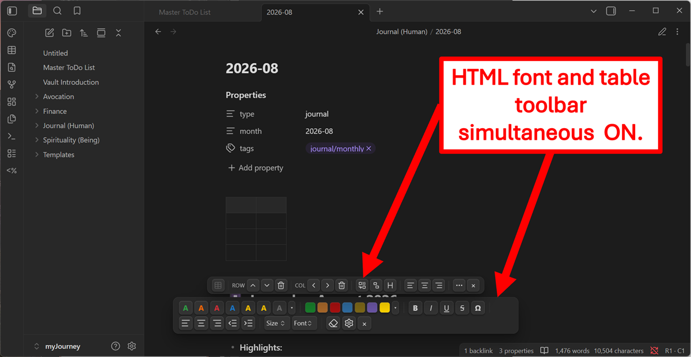
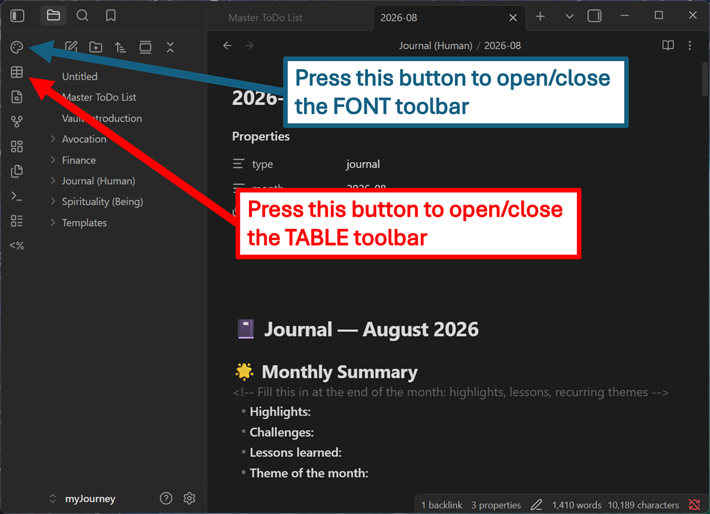
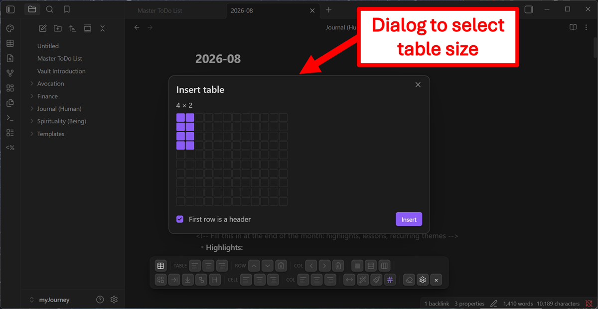
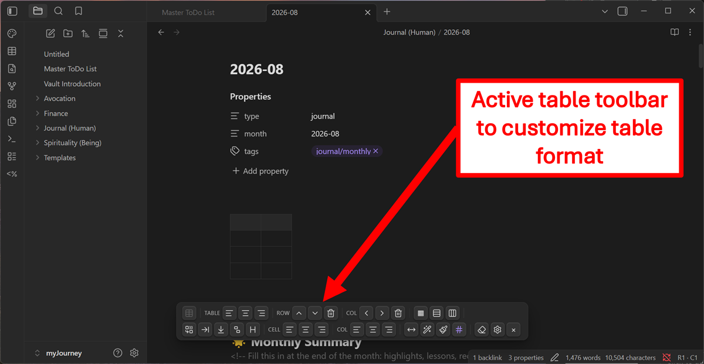
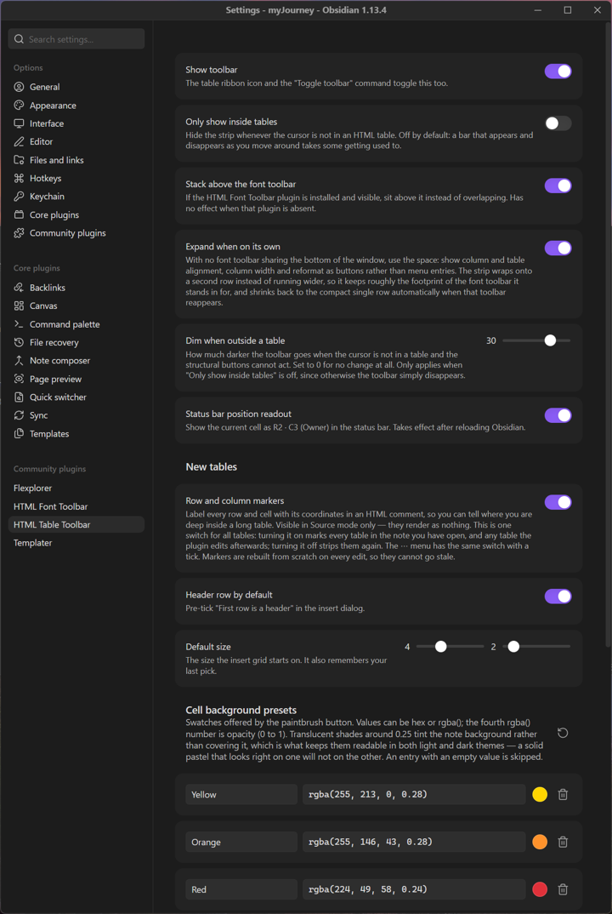

# HTML Table Toolbar

A Word-style toolbar for **HTML tables** in Obsidian notes.

Markdown pipe tables cannot merge cells, style individual cells, hold multi-block content, or centre themselves on the page. This plugin emits and edits real `<table>` markup instead, and gives you explicit buttons for the structural edits that markup normally makes tedious.



## Sister plugins

**HTML Table Toolbar** and **[HTML Font Toolbar](https://github.com/Charette-AI-Group/html-font-toolbar)** are sister plugins, built by the same author to the same house style and designed to work side by side. Neither depends on the other and neither imports the other's code — **install either one alone and it works completely.**

Install both and they coexist deliberately rather than by accident:

- **They stack instead of overlapping.** The table strip measures the font toolbar and sits above it, reacting the moment that toolbar is enabled, disabled, hidden, shown or re-wrapped by a narrower window.
- **The table strip resizes to suit.** Sharing the bottom of the window it stays a compact single row with the less-used controls behind a `⋯` menu. Alone, it expands to the font toolbar's proportions and gives every command its own button.
- **They never fight over CSS.** Every class here is namespaced `tt-`, every class there is `hft-`.
- **They divide the work cleanly.** Font formatting is universal, so that toolbar is always available — including inside table cells, where bolding a header row is a frequent need. Table controls are contextual and only act when the cursor is in a table.



Each has its own ribbon icon, so either can be shown or hidden independently:



Both are MIT-licensed and produce plain HTML, so notes render identically if either plugin is later removed.

## What it does

| | |
|---|---|
| **Insert** | Hover-grid size picker, optional header row |
| **Rows** | Insert above / below, delete |
| **Columns** | Insert left / right, delete |
| **Cells** | Merge a selected rectangle, merge with the cell right or below, split a merged cell |
| **Format** | Toggle header row, align a cell or a whole column, set column widths, shade a cell from an editable swatch grid or the OS colour picker |
| **Borders** | Whole-table pattern, plus per-row and per-column edges — each with its own thickness, line type and colour |
| **Table** | Align left / centre / right, reformat, delete |

Every button is also a command, so anything can be bound to a hotkey from **Settings → Hotkeys** (search "HTML Table Toolbar").

Tables start from a hover grid, with the header row optional:



With the cursor inside a table every control lights up, and the status bar shows where you are — `R1 · C1` at the bottom right. The insert-table button is the one control that dims here, since a table cannot be nested inside another:



## Settings



The toolbar's behaviour is adjustable — whether it hides outside tables, whether it stacks above the font toolbar, how far it dims when it cannot act, and whether it expands when it has the window to itself. The cell background swatches are fully editable: rename, recolour, add or remove them, with one-click restore of the defaults.

## Installation

**From Obsidian (recommended):** Settings → Community plugins → Browse → search for "HTML Table Toolbar".

**Manual:** download `main.js`, `manifest.json` and `styles.css` from the [latest release](../../releases/latest) into `<vault>/.obsidian/plugins/html-table-toolbar/`, then enable the plugin in Settings → Community plugins.

## Source format

Tables are written in a canonical layout — one tag per line, one **cell** per line, no blank lines:

```html
<table class="tt-table" data-tt="1">
<colgroup>
<col style="width:14em">
<col>
</colgroup>
<tr>
<th>Task</th>
<th>Owner</th>
</tr>
<tr>
<td>Design review</td>
<td class="tt-c">Alice</td>
</tr>
</table>
```

This is not cosmetic. Because each cell owns a line, the line number *is* the cell address: "which cell is the cursor in?" is arithmetic rather than an HTML parse with offset mapping. Two rules make it work, and both are load-bearing:

- **No blank lines inside the table.** Under CommonMark a blank line ends an HTML block, so a gap between rows would terminate the table and dump the rest as literal text. Cells that need internal breaks use `<br>` and stay on one line.

  A single Enter needs no `<br>` — it just wraps the cell, which is fine. It is the **blank** line that cannot survive: pressing Enter twice for a paragraph ends the HTML block, and no parser leniency can change that. The break is not lost, though — the status bar says what happened, and the next toolbar action or **Reformat table** turns it into `<br><br>`, which renders as the paragraph you meant.
- **One cell per line — or per block of lines.** Two cells sharing a line is rejected. A single cell *may* run over several lines, closing on a later one, so long prose can stay wrapped in the source the way you typed it rather than being forced onto one enormous line. The tags are the delimiters, not the line break:

```html
<td>Suffering and Trauma are somewhat the same because
trauma can be considered a "GROUP" of sufferings, i.e.,
multiple sufferings together "forms" a trauma.</td>
```

  Every line of that cell addresses that cell, so the toolbar works with the cursor anywhere inside it, and the wrapping is written back exactly as you left it.
- **All text lives between `<td>` and `</td>`.** A `<tr>` line holds nothing but the tag, and neither does `</tr>`. Typing on one of those lines — or on a line of its own between cells — makes the table unreadable to the fast parser.

That last one is the easy mistake to make, so the plugin tells you when it happens: the status bar names the line and the reason, for example `Table: line 8 — text on the <tr> line`. The toolbar stays live, because every button repairs the table before acting — pressing any of them, or **Reformat table**, puts it right.

Formatting rides on classes defined in `styles.css` (`tt-c` to centre a cell, `tt-center` to centre the table) rather than inline styles, so cell lines stay short and the content stays visually dominant when you hand-edit.

### Empty cells

An empty `<td>` contains no line box, so it collapses to the height of its padding — 19×9px against 75×30 for a filled cell, which makes a freshly inserted table nearly impossible to see or click into. Cells therefore carry a `min-width` (tunable with `--tt-cell-min-width`, default `3.5em`) and empty ones get a zero-width space from CSS, which gives them a normal text line's height. Nothing is written into the note, so there is no filler character to delete before you start typing.

### Borders

Three dialogs, at three scopes, each offering the same thickness, line type (solid, dashed, dotted, double) and colour, with a live preview.

**Table borders** sets the overall shape: **Grid** (default), **Outline** (one line around the table) or **None**. Thickness, type and colour are custom properties on the `<table>`, so a whole table restyles without a `border` declaration repeated on every cell line:

```html
<table class="tt-table" style="--tt-line-width:2px; --tt-line-style:dashed">
```

**Row borders** and **Column borders** lay individual edges over that shape — pick a row or column, then Top/Bottom or Left/Right (or Both, or None). Ruling off a header row is Table = None, Row 1 = Bottom.

**Every row and every column keeps its own line**, so row 2 can be a thick red rule while row 4 is a thin blue dashed one. Switching the dropdown loads that row's or column's current settings rather than carrying the last choice across. A column's left and right edges are independent too, since one cell can sit on the right edge of one column and the left edge of the next.

A row marks its `<tr>` and stores its format there, so the line travels with the row when you insert or delete above it. A column has no element of its own — `<col>` borders lose the collapsed-border conflict against cells — so it marks the cells sitting on that edge:

```html
<tr class="tt-rb" style="--tt-row-width:2px; --tt-row-color:#c00">
<td class="tt-cr" style="--tt-cr-color:#00c">…</td>
```

Anything an edge does not override falls back to the table's own line, so "same as the table" writes nothing and keeps tracking the table if that changes. Defaults are never written out, so an ordinary table carries no inline style at all.

All of this depends on `border-collapse: collapse`, where adjacent cells share one edge. That has two consequences the dialogs handle for you: dropping a side from every cell removes the line outright rather than leaving a neighbour's half behind, and a per-edge line has its competing side suppressed so that a dashed rule is not quietly beaten by a neighbouring solid one.

### Row and column markers (optional, off by default)

Long tables are hard to navigate in source: forty rows down, the header has scrolled away and nothing tells you which column a given `<td>` belongs to. Turning markers on labels every cell with its coordinates:

```html
<tr>
<td><!-- r02c01 -->Design review</td>
<td><!-- r02c02 -->Alice</td>
<td><!-- r02c03 -->Blocked on the API spec</td>
</tr>
```

**Nothing is written on the `<tr>` line.** A comment there would read like a labelled field with room after it — and text on a `<tr>` line is precisely what makes a table unreadable. Each cell carries its full coordinate instead, so there is nothing to cross-reference between lines either.

Markers ride on lines that exist anyway, so the table never grows a line and the line-as-address arithmetic is untouched.

Numbering is by **grid** column, not by position in the row, so it stays true under merged cells. A cell that spans states its range on whichever axis it spans, and its neighbours keep the real numbers:

```html
<tr>
<td colspan="2"><!-- r01c01-02 -->Wide</td>
<td><!-- r01c03 -->Tail</td>
</tr>
<tr>
<td><!-- r02c01 -->a</td>
<td><!-- r02c02 -->b</td>
<td><!-- r02c03 -->c</td>
</tr>
```

They cannot go stale: the whole table is re-serialized on every operation, so markers are regenerated from scratch each time rather than patched. They render as nothing in every Markdown tool, and are visible in **Source mode** only.

Markers are **one global switch**, not per-table state — the `⋯` menu shows it with a tick, and it is mirrored in settings. Turning it on marks every table in the note you have open, and every table the plugin edits from then on; turning it off strips them the same way. Tables in other notes catch up the next time you open and edit them.

A table the fast parser cannot read is left untouched by the switch rather than silently reformatted — run **Reformat table** on it first.

### If you break the layout

You will, eventually. **Reformat table** (overflow menu, or the command) runs the table through a real HTML parser and rewrites it in canonical form. Structural operations also attempt this automatically before giving up, so a hand-edited table usually just works.

## Portability

Raw HTML in `.md` is mid-tier portable. Known behaviour:

| Target | Result |
|---|---|
| Obsidian, Typora, VS Code preview, markdown-it | Renders fully |
| GitHub / GitLab | `colspan`/`rowspan` survive; `class` is stripped, so the table renders unstyled |
| Hugo (goldmark, default) | Raw HTML omitted entirely |
| Pandoc → docx/PDF/LaTeX | Raw HTML discarded |
| Reddit / Discord / Slack | No HTML support |

Also note that Markdown inside HTML (`**bold**`, `[[wikilinks]]`) is not processed per CommonMark. Obsidian is more permissive, so content that looks right in-vault can render as literal asterisks elsewhere.

**The bigger cost is editing, not rendering.** Obsidian's native table controls, Advanced Tables, Excel paste, and Dataview all operate on pipe tables and ignore `<table>` entirely. The trade is "editable everywhere, limited features" → "viewable most places, editable only here". Good for build-once/read-often reference tables; worse for working documents.

## Development

No build step — `main.js` is plain CommonJS, loaded by Obsidian as-is.

```bash
node --test "tests/*.test.js"
```

```bash
powershell -File scripts/syncToVault.ps1
```

then **Ctrl+P → Reload app without saving** in Obsidian.

Tests come in three layers: the pure engine (parse, serialize, grid mapping and every structural operation) through `module.exports.__internals`; the plugin's operations driven against a fake editor; and the toolbar itself, built against a DOM stand-in so that every button is clicked and every dialog opened on each run.

## Support

If this plugin is useful to you, consider supporting development:

[](https://www.paypal.com/donate/?hosted_button_id=FEM4WLD7LHY36)

Made by [Charette AI Group](https://charette-ai-group.github.io/web/).

## License

[MIT](LICENSE) © 2026 Charette AI Group, LLC
